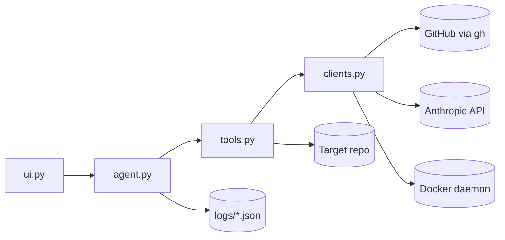

# Agentic PR

A minimal, iterable system for keeping a pull request merge-ready: green CI, resolved review threads and no merge conflicts for delivering better software faster. 

**Python:** `agent.py` orchestrates the loop, `tools.py` defines agent capabilities, `clients.py` talks to GitHub/Anthropic/Docker, and `ui.py` is the CLI.

## Installation

### Prerequisites

- [GitHub CLI](https://cli.github.com/) (`gh`) authenticated: `gh auth login`
- Python 3.11+
- Optional: `ANTHROPIC_API_KEY` for LLM
- Optional: Docker for isolated sandbox environment for test runs
- A target repo with an open PR

### 1. Configure & Install Dependencies

```bash
pip install -r requirements.txt
cp config/example.yaml config/active.yaml
```

Edit `config/active.yaml` with your repository name, PR number, and guardrail preferences.

### 2. Check PR Status

```bash
python3 ui.py status
```

Fetches the current PR state via `gh` and prints a JSON summary. No LLM call is made. Writes `logs/latest-status.json` and `logs/latest-comments.json`.

### 3. Export Anthropic API Key

```bash
export ANTHROPIC_API_KEY=...

OR

Create a .env file with ANTHROPIC_API_KEY=...
```

### 4. Running the Agent

#### Single Iteration

```bash
# With Claude
python3 ui.py once --cwd /path/to/target/repo

# Observation only
python3 ui.py once --no-llm
```

#### Continuous Loop

```bash
# Fixed interval from config/active.yaml (loop.interval)
python3 ui.py loop --mode fixed

# Dynamic — poll until CI/merge state changes
python3 ui.py loop --mode dynamic
```

#### Interactive REPL

```bash
python3 ui.py repl
```

Commands: `status`, `once`, `loop fixed`, `loop dynamic`, `quit`

## Architecture Diagram



## Guardrails

When CI fails for reasons outside the PR's diff, the agent stops and reports it. Merging the latest `base_branch` first is often the fix or another PR may have already resolved the issue on main.

The agent will not, by default:

- Edit `.github/workflows` to force failing checks to pass
- Make changes outside the PR's diff scope
- `git push` without `auto_push: true` in config or explicit user approval that allows it to
- Merge the PR into `main` or a branch without `auto_merge: true` in config

## Modules

| File         | Role                                                                         |
| -------------| ---------------------------------------------------------------------------- |
| `agent.py`   | `Agent` class — state, observe → reason → act loop, fixed/dynamic scheduling |
| `clients.py` | `GitHubClient`, `AnthropicClient`, `DockerClient`, `MonitorConfig` loader    |
| `tools.py`   | `Tool` base class + PR status, comments, shell, file write, docker exec      |
| `ui.py`      | CLI: `status`, `once`, `loop`, `repl`                                        |

---

### `config/example.yaml`

**Achieves:** Single source of truth for target PR and safety limits.

### `prompts/monitor.md`

The agent instruction set for one iteration: priority order (conflicts → CI → comments), guardrails, stop conditions and output format.

**Achieves:** Repeatable agent behavior across sessions and loop ticks.

### `.cursor/rules/pr.mdc`

Cursor rule that wires the repo together: when to run the monitor, which prompt to follow, loop modes and production discipline.

**Achieves:** Persistent context so you don't re-explain the workflow every chat.

### `logs/`

Runtime artifacts (`latest-status.json`, `latest-comments.json`, `last-run.log`).

### `.github/workflows/pr-status-report.yml`

Optional GitHub Action: on PR/check events, runs `python ui.py status` and comments a merge-readiness table on the PR.

**Achieves:** CI/CD learning path — observability in GitHub without giving the Action permission to push code fixes.

---

## Suggested iteration path (CI/CD skills)

| Phase        | What to add                                                        |
| ------------ | ------------------------------------------------------------------ |
| **Now**      | Local loop + manual agent fixes                                    |
| **Next**     | Copy GHA workflow into target repo; comment on every CI completion |
| **Then**     | `auto_push: true` with branch protection + required checks         |
| **Later**    | Cursor SDK or GitHub App for autonomous fix PRs                    |
