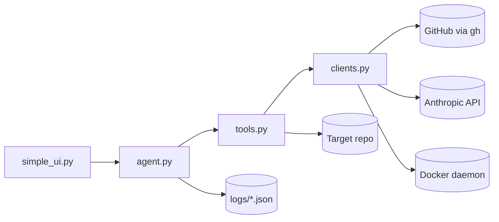

# PR Merge Agentic Loop

A minimal, iterable system for keeping a pull request merge-ready: green CI, resolved review threads and no merge conflicts for delivering better software faster. 

**Python:** `agent.py` orchestrates the loop, `tools.py` defines capabilities, `clients.py` talks to GitHub/Anthropic/Docker, and `simple_ui.py` is the CLI.

## Quick start (Python)

### Prerequisites

- [GitHub CLI](https://cli.github.com/) (`gh`) authenticated: `gh auth login`
- Python 3.10+
- Optional: `ANTHROPIC_API_KEY` for autonomous tool use
- Optional: Docker for isolated test runs
- A target repo with an open PR

### 1. Configure

```bash
cp config/example.yaml config/active.yaml
# Edit repo, pr, and base_branch
```

### 2. Install dependencies

```bash
pip install -r requirements.txt
```

### 3. Snapshot PR health

```bash
python simple_ui.py status
```

### 4. Run one monitor iteration

```bash
# With Anthropic tool-use loop
export ANTHROPIC_API_KEY=...
python simple_ui.py once --cwd /path/to/target/repo

# Observation only (no API key)
python simple_ui.py once --no-llm
```

### 5. Start a loop

```bash
# Fixed interval from config/active.yaml (loop.interval)
python simple_ui.py loop --mode fixed

# Dynamic — poll until CI/merge state changes
python simple_ui.py loop --mode dynamic --max-iterations 10
```

### 6. Interactive REPL

```bash
python simple_ui.py repl
```

Commands: `status`, `once`, `loop fixed`, `loop dynamic`, `quit`

---

## Architecture




### Python modules


| File           | Role                                                                         |
| -------------- | ---------------------------------------------------------------------------- |
| `agent.py`     | `Agent` class — state, observe → reason → act loop, fixed/dynamic scheduling |
| `tools.py`     | `Tool` base class + PR status, comments, shell, file write, docker exec      |
| `clients.py`   | `GitHubClient`, `AnthropicClient`, `DockerClient`, `MonitorConfig` loader    |
| `simple_ui.py` | CLI: `status`, `once`, `loop`, `repl`                                        |


---

## What each file does

### `config/example.yaml`

Template configuration. Copy to `config/active.yaml` (gitignored) for your PR.


| Section                     | Purpose                                                                |
| --------------------------- | ---------------------------------------------------------------------- |
| `repo`, `pr`, `base_branch` | Which PR to monitor                                                    |
| `guardrails`                | Bounds agent autonomy (max files, no workflow edits, push/merge gates) |
| `loop`                      | Interval and poll settings for loop scripts                            |
| `notifications`             | Hooks for future Slack/email alerts                                    |


**Achieves:** Single source of truth for target PR and safety limits.

---

### `prompts/monitor.md`

The agent instruction set for one iteration: priority order (conflicts → CI → comments), guardrails, stop conditions, output format.

**Achieves:** Repeatable agent behavior across sessions and loop ticks.

---

### `.cursor/rules/pr.mdc`

Cursor rule that wires the repo together: when to run the monitor, which prompt to follow, loop modes, production discipline.

**Achieves:** Persistent context so you don't re-explain the workflow every chat.

---

### `logs/`

Runtime artifacts (`latest-status.json`, `latest-comments.json`, `last-run.log`). Gitignored except `.gitkeep`.

**Achieves:** Audit trail and stable file paths for the agent to read.

---

### `.github/workflows/pr-status-report.yml`

Optional GitHub Action: on PR/check events, runs `python simple_ui.py status` and comments a merge-readiness table on the PR.

**Achieves:** CI/CD learning path — observability in GitHub without giving the Action permission to push code fixes. Copy into your app repo when ready.

---

## Suggested iteration path (CI/CD skills)


| Phase        | What to add                                                        |
| ------------ | ------------------------------------------------------------------ |
| **Now**      | Local loop + manual agent fixes                                    |
| **Next**     | Copy GHA workflow into target repo; comment on every CI completion |
| **Then**     | `auto_push: true` with branch protection + required checks         |
| **Later**    | Cursor SDK or GitHub App for autonomous fix PRs                    |
| **Advanced** | Webhook receiver instead of polling; Slack on `blocked_reasons`    |


---

## Cursor usage examples

```
python simple_ui.py status
Follow prompts/monitor.md. Fix in-scope CI failures on PR #42.
```

```
/loop 5m Run python simple_ui.py once and follow prompts/monitor.md
```

```
Monitor PR until merge-ready. Stop if changes would touch workflows.
```

---

## Guardrails reminder

The agent should **not**:

- Edit `.github/workflows` to make failing checks pass
- Make unrelated drive-by refactors
- Force-push or merge without explicit approval (unless config enables it)

When CI fails for reasons outside the PR's diff, merge the latest `base_branch` first — another PR may have already fixed main.